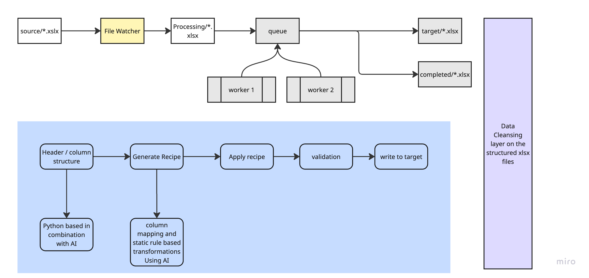

# Excel Data Ingestion Pipeline

## Overview

An intelligent Excel data processing pipeline that combines deterministic algorithms with AI-powered transformation to automate data ingestion from heterogeneous Excel files into standardized output formats.

## Architecture

### Core Components

- **Structure Detection Engine** - Pandas-based header row identification with LLM tie-breaker resolution
- **AI Transformation Engine** - Groq-powered recipe generation for column mapping and data transformation
- **Data Quality Framework** - Statistical validation and row filtering using mode-based thresholds
- **File Processing Orchestrator** - Multi-threaded watcher with queue-based file handling

### Technology Stack

- **Python 3.8+** - Core processing framework
- **Pandas** - Data manipulation and Excel file handling
- **OpenAI** - Large Language Model for intelligent transformation
- **Pydantic** - Data validation and schema management
- **Watchdog** - File system monitoring and event handling
- **OpenPyXL** - Excel file reading and writing

## Data Flow

### 1. Source Ingestion
- **Source Folder** (`/data/source`) - Raw Excel files deposited by external systems
- **File Detection** - Real-time monitoring for new Excel files
- **Queue Management** - Automatic file enqueuing for distributed processing

### 2. Structure Analysis
- **Header Detection** - Deterministic scoring algorithm identifies header row location
- **Column Profiling** - Extracts column names and metadata for transformation mapping
- **LLM Resolution** - AI resolves ambiguous header detection scenarios

### 3. Transformation Generation
- **Deterministic Pre-matching** - Algorithm-based column name normalization and mapping
- **AI Recipe Generation** - LLM creates transformation rules for unmapped columns
- **Schema Validation** - Pydantic ensures transformation recipe integrity

### 4. Data Processing
- **Recipe Application** - Applies column transformations, renames, splits, and merges
- **Quality Validation** - Statistical filtering removes sparse and invalid rows
- **Output Generation** - Creates standardized Excel files with target schema

### 5. Archive Management
- **Completed Folder** (`/data/completed`) - Processed source files archived for audit
- **Target Folder** (`/data/target`) - Cleaned and transformed output files
- **Process Folder** (`/data/process`) - Temporary workspace during processing
